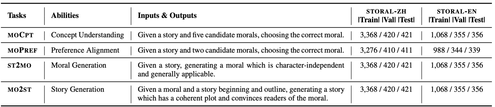
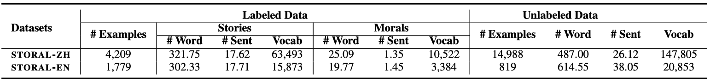

# STORAL: A Corpus for Understanding and Generating Moral Stories

## Introduction

STORAL is a collection of 4k Chinese and 2k English human-written stories paired with morals. We propose two understanding tasks and two generation tasks on STORAL to test machinery abilities. The paper will be published in NAACL 2022.

## Tasks

We design STORAL as an aggregation of two understanding tasks including moCpt and moPref, and two generation tasks including ST2MO and MO2ST. We show the task descriptions in the table below.



## Datasets

We show the data statistics in the table below. The datasets (`data.zip`) can be downloaded from [THUCloud](https://cloud.tsinghua.edu.cn/f/30c6f822205c41738cc8/?dl=1).



Unzip `data.zip` and you can find three directories:

- `storal_unlabel` : unlabeled data. 

- `storal_label`: labeled data for four proposed tasks. Each line is an example.

  ```python
  # an example for the moCpt task
  {
    "story": "The mice once ...",    # the given story
    "moral1": "One begins ...",    # the 1st candidate moral
    "moral2": "A fool can ...",    # the 2nd candidate moral
    "moral3": "It is one thing ...",    # the 3rd candidate moral
    "moral4": "We should not ...",    # the 4th candidate moral
    "moral5": "Never be so shy ...",    # the 5th candidate moral
    "label": 3    # the ground-truth label (the 3rd candidate)
  }
  
  # an example for the moPref task
  {
    "story": "The mice once ...",    # the given moral
    "moral1": "it is one thing ...",    # the 1st candidate moral
    "moral2": "it is one thing ...",    # the 2nd candidate moral
    "label": 2,    # the ground-truth label (the 2nd candidate)
  }
  
  # an example for the ST2MO task
  {
    "story": "The mice once ...",    # the given story
    "moral": "It is one thing ..."    # the target moral
  }
  
  # an example for the MO2ST task
  {
    "moral": "It is one thing ...",    # the given moral
    "outline": ["constant fear" ...],    # the given outline
    "beginning": "The mice once ...",    # the given beginning
    "input": "It is one thing ...",    # the given input including the moral, the outline, the beginning
    "story": "the cat. At least they wished...",    # the target story
  }  
  ```

- `storal_label_retrieve`: story-moral pairs with retrieved related morals and outlines. We get the representation of a moral or story using the script `./retrieve/get_representation.py`. 

  ```python
  {
    "story": "The mice once ...",    # initial story
    "moral": "It is one thing ...",    # initial moral
    "retrieve_moral": ["In unity is strength.", "Industry is itself a treasure.", ...],    # retrieved morals (using the representation of the initial story to retrieve 10 most nearest stories and obtain the corresponding morals)
    "retrieve_outline": ["close", "realize", ...] # retrieved outlines (using the representation of the initial moral to retrieve 10 most nearest morals and obtain the outlines of corresponding stories)
  }
  ```

## Training and Evaluation

The example data, training and evaluation scripts for the understanding/generation tasks are under the directory `understanding`/`generation`, respectively. 

- Understanding tasks:
  - BERT-Style models:
    - Data example: `data_en` and `data_zh` under `./understanding/bert/`. Note that replace `[MASK]` with `<mask>` when training RoBERTa on the English dataset.
    - Training: `bash ./understanding/bert/run.sh`
    - Evaluation (computing accuracy): `bash ./understanding/bert/acc.sh`
  - T5:
    - Data example: `data_en` and `data_zh` under `./understanding/t5/`. 
    - Training: `bash ./understanding/t5/run.sh`
    - Evaluation (computing accuracy): `bash ./understanding/t5/acc.sh`
- Generation tasks:
  - Data example:  `mo2st_data_en`, `mo2st_data_zh`, `st2mo_data_en` and `st2mo_data_zh` under `./generation/t5/`. 
  - Training: `bash ./generation/t5/run.sh`
  - Generation: `bash ./generation/t5/gen.sh`
  - Evaluation (computing bleu, bertscore, repetition, distinct, coverage, order): `bash ./generation/evaluation/eval.sh`. We provide some generated examples under `./generation/evaluation/mo2st` and `./generation/evaluation/st2mo`.

We provide the checkpoints of RoBERTa and T5 that are post-trained on the unlabeled data at [THUCloud](https://cloud.tsinghua.edu.cn/d/012c968e4c8a4873b212/). For RA-RoBERTa and RA-T5, we concatenate the source inputs with the retrieved moral concepts or story outlines as new inputs. We extract concepts from a moral using `./retrieve/get_concepts.py`.

## Dependencies

```
datasets                1.6.2
huggingface-hub         0.0.8
jieba                   0.42.1
jsonlines               2.0.0
nltk                    3.5
numpy                   1.19.5
pytorch-lightning       1.2.0
regex                   2020.11.13
rouge                   1.0.1
rouge-score             0.0.4
sacrebleu               1.5.0
scipy                   1.5.4
sentencepiece           0.1.95
tokenizers              0.10.1
torch                   1.8.1
torchaudio              0.8.0
torchmetrics            0.2.0
torchvision             0.9.0
transformers            4.6.1
```

